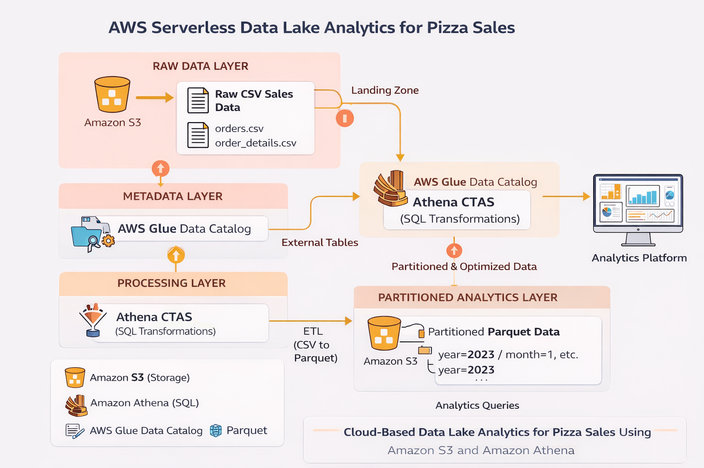

# AWS Serverless Data Lake Analytics – Pizza Sales Dataset


This project demonstrates how to build a **serverless data lake architecture on AWS** for performing scalable SQL analytics on raw datasets using **Amazon S3, Amazon Athena, and AWS Glue Data Catalog**.

---

# Table of Contents

- Architecture
- Tech Stack
- Data Pipeline
- Pipeline Orchestration
- Project Structure
- Example Query
- Key Implementations
- Key Learnings

---

# Architecture

This project implements a **three-layer data lake architecture (Medallion Architecture)**.

### Bronze Layer – Raw Data
Raw CSV files are stored in **Amazon S3**.

Example datasets:
- orders.csv
- order_details.csv
- pizzas.csv
- pizza_types.csv

Purpose:
- Raw ingestion layer
- Source-of-truth data
- No transformation applied

---

### Silver Layer – Processed Data
Data is converted from **CSV → Parquet** using **Athena CTAS queries**.

Benefits:
- Columnar storage format
- Faster query performance
- Reduced data scan cost

---

### Gold Layer – Optimized Analytics
Processed data is further optimized using **partitioning (year/month)**.

Benefits:
- Query pruning
- Faster execution
- Reduced Athena query cost

---



---

# Tech Stack

- **Amazon S3** – Data lake storage
- **Amazon Athena** – Serverless SQL analytics
- **AWS Glue Data Catalog** – Metadata and table definitions
- **SQL** – Data transformations and analytics
- **Parquet** – Columnar storage format for optimized queries

---

# Data Pipeline

Raw CSV Data  
↓  
Amazon S3 (Raw Data Lake)  
↓  
Athena External Tables (Schema-on-read)  
↓  
Athena CTAS Transformation (CSV → Parquet)  
↓  
Partitioned Tables (year/month)  
↓  
Athena SQL Analytics

---
## Pipeline Orchestration

In a production environment, the data pipeline would be orchestrated using tools such as:

- Apache Airflow
- AWS Glue Workflows
- AWS Step Functions

The pipeline stages would be:

1. Data ingestion to S3 (Raw Layer)
2. Transformation using Athena CTAS
3. Conversion to Parquet format
4. Partitioning optimized datasets
5. Analytical queries for reporting

---

# Project Structure

aws-serverless-data-lake-athena
│
├── architecture
│ aws-data-lake-architecture.png
│
├── pipeline
│ data_pipeline_explanation.md
| athena_pipeline.sql
│
├── sql
│ create_external_tables.sql
│ convert_csv_to_parquet.sql
│ partitioned_table.sql
│ analytics_queries.sql
│
├── dataset_info
│ dataset_description.md
│
└── README.md


---

# Key Implementations

- Created **external tables in Amazon Athena** to query S3 datasets using schema-on-read
- Converted raw CSV datasets into **columnar Parquet format** using Athena CTAS
- Implemented **partitioned tables (year/month)** to optimize query performance
- Performed analytical SQL queries including **joins, aggregations, and revenue analysis**

---

# Example Query

```sql
SELECT
    pt.category,
    SUM(od.quantity * p.price) AS revenue
FROM order_details od
JOIN pizzas p
    ON od.pizza_id = p.pizza_id
JOIN pizza_types pt
    ON p.pizza_type_id = pt.pizza_type_id
GROUP BY pt.category
ORDER BY revenue DESC;
```

### Key Learnings

Implemented a serverless data lake architecture on AWS

Queried raw data directly from S3 using Athena external tables

Optimized analytics performance using Parquet columnar storage

Reduced Athena scan costs using data partitioning

Designed a Medallion-style data pipeline (Bronze → Silver → Gold)


---


